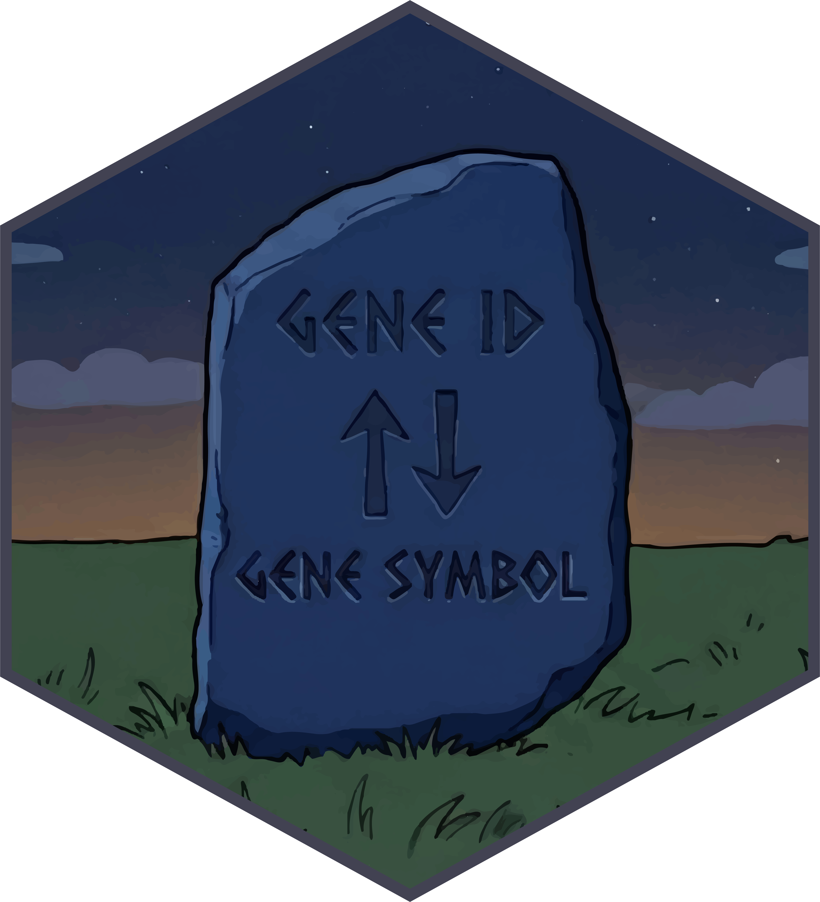

# geneRosetta



geneRosetta builds real-time, multi-sourced gene annotations and maps between gene symbols and stable gene identifiers (Ensembl, NCBI, HGNC/MGI/RGD IDs). Make sure your gene annotations are always up-to-date!

As gene symbols are updated frequently, mapping supports all alternative/old gene symbols (*synonyms*) and provides flexible handling of genes with multiple mappings. Local caching ensures the analysis is fast. 

*Supports human, mouse and rat organisms.*

# Installation

```r
# with devtools
if (!require("remotes")) install.packages("devtools")
devtools::install_github("alexankc/geneRosetta")
# or
if (!require("remotes")) install.packages("remotes")
remotes::install_github("alexankc/geneRosetta")
```

# Quick Start

```r
library(geneRosetta)
```


## Step 1: Build (or load cached) merged annotation

```r
annot <- buildAnnotation(species = "human") # "human", "mouse", "rat" are currently supported
```

## Step 2: Map gene symbols ↔ gene IDs (Ensembl/NCBI)

Input can be both a *vector* or a *dataframe*.

#### Gene Symbols → Gene IDs

```r
id_lookup <- mapSymbolToID(
	input_data = c("p53", "INS", "FAKEGENE"), #input as vector
	annotation = annot,
	add_metadata = TRUE # add additional metadata
)

id_mapped <- id_lookup$mapped # mapped genes
id_unmapped <- id_lookup$unmapped # unmapped genes
```

#### Gene IDs → Gene Symbols
```r
genes_df = data.frame(
	gene_ids = c("ENSG00000230417", "ENSG00000226087", "ENSG00000139515"),
	scores = c(5, 3, 2)
)

symbol_lookup <- mapIDToSymbol(
	input_data = genes_df, #input as dataframe
	col_id = "gene_ids",
	annotation = annot,
	multi_handling = "collapse",  # output of multi-mapped: keepAll | collapse | unique
	keep_unmapped = TRUE # keep unmapped genes in the df
)

symbol_mapped_df <- symbol_lookup$mapped # multiple mapped symbols collapsed by "|"
symbol_multimapped <- symbol_lookup$multi_mapped  #df with IDs mapped to multiple symbols
```

Key Features
------------

* **Up-to-Date Annotations**: Annotations are automatically synchronized with the most recent versions of source databases.

* **Synonym Rescue**: If a gene symbol isn't found as it (*primary* mapping), all gene synonyms are searched to ensure maximum mapping coverage.

* **Multi-Mapping Handling**: If a gene symbol matches multiple Ensembl IDs and vice versa, you can choose how to present the output:
    * `keepAll`: Retains all matches as separate records in multiple rows.
    * `collapse`: Merges multiple IDs into a single row (ideal for summary reporting).
    * `unique`: Filters to keep only a single (the first) representative record.

* **Metadata**: If *TRUE*, gene biotype, genomic coordinates, extrernal gene identifiers and description is added for the mapped inputs.

* **Unmapped Rows**: Flexible handling for unmapped inputs - choose to keep unmapped to maintain your original row count, or **remove** them for a cleaner dataset.

* **Database Version Tracking**: Print and store the exact database release versions used to build your annotations with a single command.

## 📖 Documentation

For a detailed guide please check:
👉 [**Getting Started Tutorial**](https://alexankc.github.io/geneRosetta/articles/geneRosetta_tutorial.html)

Getting Help / Contributing
---------------------------

Please open an issue in the repository with a clear description, minimal reproducible example, session info (sessionInfo()), and relevant logs.


